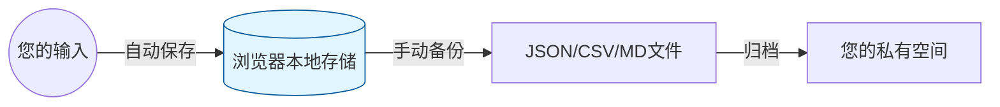

# 🌈 每日状态轻记录 (Mood Control Log)

> **“记录，是重拾感受和控制感的最佳方式。”**
> 这是一个专为焦虑、抑郁或生活无序感中的用户设计的**纯离线、无追踪**自我记录工具。通过结构化的引导，帮助您将脑海中混乱的思绪“外化”，从微小的记录中找回生活的确定性。

## 💡 为什么需要这个工具？

在情绪低落或生活失控时，我们往往面临以下困境：

* **思绪发散**：脑海中充满乱麻，无法理清情绪的源头。
* **习得性无助**：觉得一天什么都没做，陷入自我否定。
* **认知负荷**：复杂的日记模板让人望而却步。
* **隐私焦虑**：担忧最私密的感受被上传至云端分析。

### 🛡️ 核心设计哲学

* **极简原则**：如果今天特别累，只拉动滑块量化情绪即可。
* **去评判化**：记录是为了客观观察，而非因“表现不好”而自责。
* **认知卸载**：强制大脑筛选当日最重要的信息，减少记忆负担，将带宽留给生活本身。
* **行动导向**：通过“自爱行动”与“明日小事”，将注意力从痛苦转向行动。

---

## ✨ 核心功能模块

| 分类 | 关键功能 | 心理学/工具价值 |
| --- | --- | --- |
| **状态觉察** | **情绪/能量双轴评分** & 睡眠记录 | 帮助区分生理性疲劳与心理性低落，建立基础感知。 |
| **价值捕捉** | **开心三件事** & 自爱行动 & 掌控感记录 | 训练大脑在大脑噪声中精准捕捉积极信号，找回控制权。 |
| **深度探索** | **情绪触发点分析** & 消费行为觉察 | 识别代偿性消费逻辑，建立针对性的“情绪自救”机制。 |
| **数据赋能** | **7日趋势图表** & 多格式导出/导入 | 进步可视化，数据支持 Markdown、CSV、JSON 自由流转。 |

## 🚀 快速上手指南

1. **即下即用**：下载本仓库的 `index.html` 文件，双击使用任何主流浏览器打开即可（[预览地址](https://dubianmasuo.github.io/MoodControlLog/)）
3. **极致交互**：
* **无需手动保存**：内置防抖算法，停止输入 **1.2秒内自动持久化** 到本地。
* **历史锁定**：默认锁定历史记录，修改需手动点击“解锁”，保护记录的严肃性。

3. **多端适配**：响应式布局支持手机、平板与电脑访问，无碍随时随地记录。

---

## 🔒 隐私与数据安全说明

本工具采用 **隐私优先 (Privacy First)** 的设计方案，确保您的数据像纸质日记一样安全：

* **100% 离线记录**：所有数据均存在您本地浏览器的 `localStorage` 中，**绝不上传任何服务器**。
* **物理隔离备份**：数据完全在您的本地闭环，请务必定期通过导出功能进行物理备份。

---

## 🤝 AI 协作开发故事 (AI Contribution)

本项目是人类需求与多个模型智慧深度融合的产物，展现了高效的 AI 协同开发链路：

* **🌱 灵魂注入 (Gemini)**：奠定了 CBT 心理学框架，提供了温暖的引导文案，并输出了**最初版本的代码原型**。
* **🛠️ 代码工程 (Grok / Cursor)**：在原型基础上实现了多格式导出引擎、趋势图表集成及复杂的冲突合并逻辑。
* **⚖️ 逻辑锐评 (DeepSeek)**：对底层存储结构与合并机制提供了关键的优化洞察与代码重构。
* **👁️ 体验洞察 (ChatGPT)**：扮演了关键评审员角色，优化了“防自责设计”的人文温度。
> **ChatGPT 评价原文：**
> “这份代码不像是随机生成的，它在一个非常清晰的人类需求指导下完成。尤其是文案的温度、防失败设计、‘记录 ≠ 表现好’的隐含逻辑。”

* **📱 其他尝试**：曾使用**秒哒**平台进行小程序化初步设计（[预览地址](https://www.miaoda.cn/projects/app-8df9vrzwo2rl/preview)），因点数限制暂缓。

---

## 📞 免责声明

本工具旨在辅助自我觉察与情绪管理，**不能替代专业的心理咨询或医疗建议**。如感严重不适，请务必寻求专业医疗帮助。

> **维护者的话**：*“记录是疗愈的开始，任何一笔微小的笔触都比完全放弃要有力。”*

## 🚧 迭代记录
* **2025年12月22日**：修复导入数据时无有效记录的bug、修复自动保存逻辑与有效记录判断逻辑的冲突问题

---

**开始记录吧，每一步都是对自己的温柔关照。** 💖
